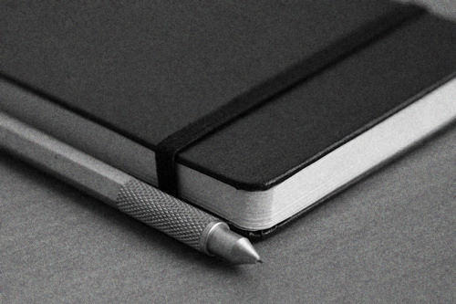

Devenir minimal : toutes les infos à suivre
###########################################
:date: 2012-03-06 09:06

Traduction de http://mnmlist.com/getting-to-minimal-all-the-info-you-need-to-track/.

    
    Photo courtoisie de `alt1040 <http://www.flickr.com/photos/alt1040/11220515/>`_

`Par Leo <http://twitter.com/zen_habits>`_

Le blog ‘a million monkeys typing’ (apparemment défunt) a un ancien billet intéressant appelé `L'esprit du débutant <http://www.douglasjohnston.net/weblog/archives/2005/06/27/beginners-mind/>`_ dans lequel l'auteur dresse une liste des informations qu'il a besoin de suivre.

Douglas utilise l'approche de “l'esprit du débutant” et dresse une liste de tous les types d'informations qu'il a besoin de suivre, incluant, mais non limitée à : 

* tâches
* tâches déléguées à surveiller
* dépenses
* rendez-vous
* projets
* contacts
* dates butoir
* informations quotidiennes
* identifiants/mots de passe
* informations de location de voiture
* commissions

Ce n'est pas la liste complète, mais il a été capable de la réduire à environ une douzaine de choses à surveiller. Et je pense que c'est moins que pour la plupart des gens, parce qu'il n'a gardé que les essentiels (pour lui). Réalisez, bien entendu, que les besoins de chacun sont différents, et que ce qui est essentiel pour l'un ne l'est pas pour l'autre. Néanmoins, cet exercice est utile. Faites une liste de tout ce que vous avez besoin de surveiller, puis trouvez la manière la plus simple et intuitive de le faire. En utilisant les outils les plus simples.

À titre d'exercice, voici ma liste :

* tâches
* rendez-vous
* contacts
* identifiants/mots de passe
* suivis de remise en forme et de santé (manger sain, faire de l'exercice)

Il est possible que j'oublie deux ou trois choses. Et ce n'est pas la liste la plus courte possible. Mais laissez moi vous dire comment je suis arrivé si loin, puis nous regarderons comment je pourrais la rendre encore plus petite.

Comment je l'ai réduite
~~~~~~~~~~~~~~~~~~~~~~~

Il y a quelques années, ma liste aurait été beaucoup plus longue. Par exemple, à un moment je surveillais toutes mes dépenses, toute ma dette, chaque facture et quand elle devait être réglée. Je ne le fais plus. A un moment donné je notais tout ce que je mangeais, chaque calorie, et chaque calorie que je brûlais en faisant du sport. J'avais aussi un système de productivité (basé sur `GTD <http://zenhabits.net/2007/02/beginners-guide-to-gtd/>`_) beaucoup plus compliqué, qui non seulement gérait mes tâches (“prochaines actions”) mais aussi mes projets, les tâches déléguées et les *peut-être/un jour*. J'avais aussi une liste de buts, buts intermédiaires, et actions à entreprendre pour chacun. Et bien plus encore, mais je ne vais pas vous ennuyer avec tous les détails.

Lentement, j'ai réduis mes besoins :

#. J'ai graduellement changé mon travail pour qu'il corresponde à mes besoins. Ça a pris quelques années, mais j'avais pour but de travailler pour moi-même, avec mes propres conditions, et de simplifier ce que je faisais.
#. En résultat, j'ai moins de besoins — je n'ai pas besoin d'autant de rendez-vous, réunions, projets et ainsi de suite.
#. Je me suis lentement sorti de la dette, et je me suis concentré sur l'épargne, pour moins avoir à me soucier des finances. Maintenant je paie certaines factures en avance, d'autres sont réglées automatiquement, et je garde un fond de roulement sur mon compte courant pour ne pas avoir à me soucier des virements automatiques et des dépenses imprévues.
#. J'ai récemment réduis mes besoins en communication.
#. J'ai arrêté d'avoir autant de rendez-vous et de réunions.
#. Je ne me soucie plus de mes buts. Ce qui veut dire que je n'ai plus besoin de m'en préoccuper, ni de leurs étapes intermédiaires.
#. J'ai renforcé mes habitudes pour la nourriture et le sport à un point ou je n'ai plus besoin d'en être obsédé. J'ai développé une attitude détendue envers la santé, en appréciant manger sainement et faire du sport. Je suis le progrès sur `mon daytum <http://daytum.com/leobabauta>`_ juste pour le fun, et pour me motiver.
#. J'ai aussi arrêté de lire les nouvelles ou de me soucier de rester à jour sur les blogs. J'adore lire les blogs (pas les nouvelles) mais je ne ressens pas le besoin de m'y tenir à jour. Je lis pour le plaisir, sans pression.

J'écrirais sur la plupart de ces élément dans de futurs billets, étant donné qu'ils méritent qu'on s'y attarde. Le point étant, c'est faisable, et vous pouvez vous aussi repenser vos besoins, et les changer au fur et à mesure.

C'est aussi important de noter que la plupart de ces changements ne sont pas survenus à cause de mon style de vie, mais de mon attitude : je me soucie moins de mes buts, de compter les calories, des finances et consorts, et vu je m'inquiète moins, je surveille moins.

Comment je peux rogner plus
~~~~~~~~~~~~~~~~~~~~~~~~~~~

Mais je ne suis pas aussi minimal que possible. Voici ce que je peux faire, et que je ferais probablement dans les mois qui viennent, afin de réduire les informations que j'ai besoin de surveiller :

#. Adopter une approche "au jour le jour" pour les tâches. J'écrirais à ce sujet d'ici peu. En résumé, ça veut dire que je ne surveille pas mes buts, projets ou même tâches. Je me pose juste la question chaque matin “Qu'est-ce que je veux accomplir aujourd'hui ?” Puis je travaille sur ce qui me passionne le plus à chaque instant.
#. Presque complètement abandonner les rendez-vous. Dire aux gens qu'ils peuvent m'emailer ou me téléphoner durant la journée, et nous conviendrons d'une heure. Si je garde mes journées grandes ouvertes, définir une heure ne devrait pas être difficile. Je travaille déjà quasiment comme ça.
#. Me servir de la technologie pour mémoriser mes contacts et mots de passe pour moi. Je fais déjà la majorité avec Gmail — qui stocke automatiquement les adresses emails et je ne m'en soucie plus. Mon téléphone stocke principalement mes contacts téléphoniques. Je n'utilise pas de gestionnaire de mot de passe, mais je pense que je vais le faire. Bien que ceci ne veut pas dire que je n'aurais plus besoin de stocker ces informations, ça implique que je n'aurais plus besoin de m'en soucier.
#. Je n'ai plus besoin de garder un journal de mes exercices et de mon alimentation saine maintenant. Mais je me sens mieux en le faisant, pour le moment. Peut-être que dans quelques mois j'en serais à un stade ou ce sera inutile.

Bien sûr, aucune de ces solutions ne peut marcher pour tout le monde. Je les liste ici pour montrer comment il est possible de changer son attitude et ses besoins pour que la surveillance des infos soit minimale.
