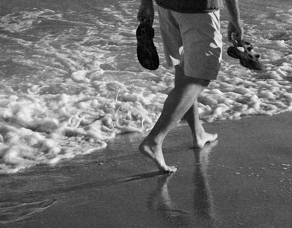

Marchez légèrement sur ce monde
#################################

Traduction de http://mnmlist.com/step-lightly/.

    
    Photo courtoisie de `la mer la mer <http://www.flickr.com/photos/through-this-window/1142135549/>`_

`Par Leo <http://twitter.com/zen_habits>`_

Il y a beaucoup à apprendre de cultures traditionnelles comme les Indiens d'Amérique. Entre autres l'idée de marcher légèrement sur cette terre.

C'est quelque chose que nous avons oublié en plusieurs centaines d'années d'efforts pour atteindre plus, produire plus, pour construire des choses plus grandes et meilleures.

Nous avons oublié de marcher légèrement, et avons à la place extrait les ressources naturelles de la terre, déforesté, pollué les rivières, lacs et océans, modifié les paysages pour coller à nos besoins, sali l'air, rendu les pluies acides et troué l'ozone.

Ce n'est pas nouveau. Et nous sommes conscient des problèmes, mais les solutions sont moins évidentes.

Est-ce que j'achète des produits plus écologiques ? Est-ce que j'achète une voiture plus écologique ? Est-ce que je recycle tout ce que j'utilise ?

Oui, bien sûr. Vous pouvez faire toutes ces choses, et elles sont utiles. Mais mieux : vivre une vie de moins, et marcher plus légèrement.

Une vie de moins implique moins de consommation, moins de ressources naturelles, moins de pollution, moins de possessions, moins de contribution aux gaz à effet de serre.

Le minimalisme, la philosophie d'une vie de moins, est plus durable parce qu'elle utilise moins, et qu'ainsi le recyclage est moins nécessaire (bien que toujours important). Ce n'est pas durable de continuer à consommer tant de produits (qu'ils soient écologiques ou pas) ou d'utiliser les ressources naturelles (qu'elles soient organiques ou pas).

Il y a beaucoup à écrire sur ce sujet, et j'en écrirais plus à l'occasion, mais voici quelques exemples :

* **Acheter moins de choses**. Acheter de nombreux produits est au cœur du problème. En savoir plus : `Pourquoi moins de choses est mieux <../pourquoi-moins-de-choses-cest-mieux.html>`_; `Consumérisme vs minimalisme <../consumerisme-vs-minimalisme.html>`_; `Repenser les nécessités <../repenser-les-necessites.html>`_.
* **Manger moins**. Les américains dans leur ensemble mangent bien trop. Ce n'est pas que l'immensité des ressources naturelles qui est utilisée pour produire toute cette nourriture, bien que ce soit énorme (documentez-vous sur la déforestation des forêts tropicales pour faire des pâturages pour les bœufs de McDonald par exemple). C'est aussi l'énorme gaspillage des restaurants, de McDonald à Lone Star en passant par Chilis, qui servent des portions énormes de nourriture saturées de gras, de sel et de sucre (et jettent ensuite la plupart), quand nous pourrions simplement manger à la maison. C'est aussi l'emballage utilisé pour toute nourriture congelée et préparée. C'est tous les problèmes de santé qui découlent de l'ingestion de tant de nourriture mauvaise pour la santé, et les ressources gaspillées pour soigner les gens malades de tout ce gras qu'ils ont mangé.
* **Manger moins de viande**. La viande n'est pas durable. La plupart des cultures sont utilisées pour l'élevage du bétail pour leur viande, leur lait ou leurs oeufs. Si nous arrêtions de manger autant de viande, nous utiliserions moins de ressources et pourrions nourrir plus de monde.
* **Utiliser moins d'emballages**. C'est fou de voir la quantité d'emballage utilisée dans tous les produits qu'on achète. Malheureusement, nous n'avons pas vraiment le choix quand nous voulons acheter quelque chose. Je pense que si le public demandait moins d'emballage, ça forcerait les fabricants à changer cette pratique de gaspillage.
* **Conduire moins**. Marcher plus. Se mettre au vélo. Utiliser les transports en commun. Partager sa voiture. Covoiturer. Rester à la maison de temps en temps.
* **Avoir une maison plus petite**. Ayez moins de choses, et vous aurez besoin de moins d'espace. Les grandes maisons sont du gaspillage, pas seulement à cause des ressources qu'elles utilisent pour être construites, mais aussi pour les climatiser, chauffer et entretenir.

Encore une fois, ce ne sont que quelques exemples. C'est plus un état d'esprit qu'une liste de ce qu'il faut faire.

“Marchez légèrement sur la terre au printemps; mère nature est enceinte.” - **Proverbe Indien d'Amérique (Kiowa)**
