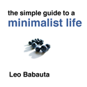

Pourquoi moins de choses c'est mieux
####################################

Traduction de http://mnmlist.com/why-less-stuff-is-better/.

`Par Leo <http://twitter.com/zen_habits>`_

Les gens me regardent parfois d'un air railleur quand je proclame que je n'ai pas besoin de plus de choses, et que je suis continuellement en train de me débarrasser de ce que j'ai. 

Quel type bizarroïde, pourquoi vouloir moins de choses ?

Moins, c'est mieux.

Moins signifie que vous dépensez moins. Que vous avez besoin de moins de stockage. Vous avez besoin d'une maison plus petite.

Moins signifie que vous vous inquiétez moins. Vous passez moins de temps à rechercher des choses. Vous êtes moins enlisés par le fouillis.

Moins signifie que vous êtes plus léger. Plus libre. Vous pouvez vous concentrer sur de meilleures choses.

Moins signifie que vous pouvez voyager plus rapidement. Vous dépensez moins de temps avec les choses, et plus de temps à faire des choses.

Moins est plus durable, plus beau.

—

**Si vous êtes intéressés par une vie de minimalisme, consultez mon nouvel ebook :** `The Simple Guide to a Minimalist Life <http://zenhabits.net/2009/09/my-new-ebook-the-simple-guide-to-a-minimalist-life/>`_.

**Ou découvrez en plus sur mes** `autres livres et ebooks <http://zenhabits.net/books/>`_.
