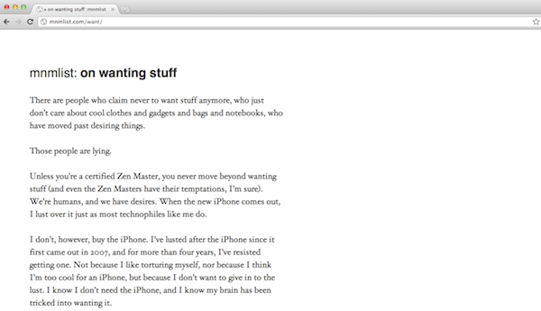
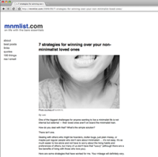
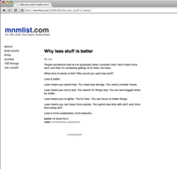

Thème
#####
:date: 2012-03-03 08:30

Traduction de http://mnmlist.com/theme/.

(NdT : si vous cherchez la version du thème adaptée pour `pelican
<https://github.com/getpelican/pelican>`_, elle est disponible sur le `dépôt
github <https://github.com/getpelican/pelican-themes/tree/master/mnmlist>`_).

Nouveau : la version trois du thème mnmlist est là !

J'ai développé un joli thème WordPress minimaliste pour mnmlist.com, et
j'aimerais le partager avec mes camarades blogueurs.

Ce thème est offert gratuitement, sans copyright, tel quel.

Une capture d'écran :

Le **thème mnmlist** est dépouillé, ne gardant que les bases, sans aucune
distraction par rapport au contenu. Ses particularités sont :

* Un design blanc, propre et épuré.
* Du contenu sans distractions.
* Un pied de page minimaliste.
* Rien d'autre.
* Pas d'entête.
* Pas de barre latérale.
* Pas de commentaires. Si vous voulez des commentaires, vous devrez les ajouter
  vous-même.
* Pas de *widgets*.
* Pas d'*api*.
* Pas de fonctionnalités supplémentaire.
* Pas de copyright ou DRM.
* Pas payant.

Ceci est la v3 du thème. C'est toujours sans copyright et toujours gratuit – et
le sera toujours. Dans cette version :

* j'ai supprimé plus de choses
* les fonts sont meilleures
* toujours pas de barre latérale, commentaires, entête
* toujours une page d'archives avec recherche
* toujours un design simplifié

Oui, je sais que c'est trop minimaliste pour certain, donc la version 1 est
toujours disponible ci-dessous, avec un entête et une barre latérale.

Télécharger :

`Télécharger la Version 3 du thème mnmlist
<http://media.thepowerofless.com.s3.amazonaws.com/mnmlist3.zip>`_.

Installer :

#. Télécharger le thème.
#. Le dézipper.
#. L'envoyer dans le répertoire thèmes de votre WordPress (dans wp-content).
#. Aller dans le panneau d'administration de votre WordPress, activer le thème
   mnmlist.
#. Personnaliser l'index et le pied de page avec les liens et copyright que
   vous souhaitez. Soyez libres d'enlever les crédits du thème mnmlist.
#. Personnaliser les archives pour refléter votre domaine et les catégories de
   votre blog dans la fonction de recherche.

Plus d'information dans le fichier texte README disponible dans le répertoire
du thème.

Encore une fois, ceci est offert tel quel. Si vous voulez le personnaliser,
vous êtes libres de le faire ! Changez les couleurs, fonts, style des liens …
centrez le texte, déplacez la barre latérale, ajoutez des commentaires, tout ce
que vous voulez. Si il y a des bugs, fixez-les ! J'espère que vous trouverez
une certaine valeur dans ce thème.

Version 2
~~~~~~~~~

La version 2 est toujours disponible au téléchargement :

`Télécharger la Version 2 du thème mnmlist
<http://media.thepowerofless.com.s3.amazonaws.com/mnmlist2.zip>`_.

Voici une capture d'écran :

.. image:: images/v2screenshot.png
    :alt: Capture d'écran du thème en version 2

Version 1
~~~~~~~~~

La version 1 est toujours disponible au téléchargement :

Voyez les captures d'écran :

`Télécharger la Version 1 du thème mnmlist
<http://media.thepowerofless.com.s3.amazonaws.com/mnmlist.zip>`_.

Foire Aux Questions
~~~~~~~~~~~~~~~~~~~

Q : Pourquoi n'y a-t-il ni entête, ni barre latérale, ni commentaires ?
    **R** : Je l'ai intentionnellement gardé aussi minimal que possible. J'ai
    enlevé toutes les fonctionnalités que je ne voulais pas. Si vous voulez
    plus de fonctionnalités, je vous suggère de choisir un autre thème. Ce
    thème permet aux lecteurs de se concentrer sur le contenu, et rien d'autre.

Q : Comment je change les liens dans le pied de page ?
    **R** : Les instructions sont dans le fichier "Read Me" du thème, mais en
    fait il suffit de cliquer sur "Footer" dans l'éditeur de thème de
    WordPress. Vous verrez les liens vers "uncopyright" et ce thème. Soyez
    libre de mettre votre propre information de copyright ou quoi que ce soit
    dans le pied de page. Aucun besoin de garder le crédit non plus, mais je ne
    vous en voudrais pas si vous le faites.

Q : Comment je centre l'agencement au lieu de l'avoir complètement à gauche ?
    **R** : dans "Stylesheet", tout en haut, ajoutez "margin: 0 auto;" dans les
    accolades de la ligne ``#container``. Je pense que ça devrait faire
    l'affaire mais je peux me tromper.

Q : Comment je rajoute des images dans les billets ?
    **R** : Utilisez la balise ``img``. J'ai tendance à les mettre vers le haut
    des billets, avant de commencer à l'écrire. Voici un exemple :

    .. code-block:: html

        
        <small>Photo courtesy of
            <a
            href=”http://www.flickr.com/photos/stuartpilbrow/2942333106/”>stuartpilbrow</a>.
        </small>

    Voilà pour l'image mais aussi pour le crédit de la photo sous l'image.

Q : Comment je rajoute des commentaires dans le thème ?
    **R** : C'est un peu plus compliqué, mais c'est faisable. Je ne peux vous
    donner des instructions détaillées ici, mais en un mot, ce que vous devrez
    faire :

    #. Trouvez un thème qui utilise des commentaires de la manière qui vous
       convienne.
    #. Copiez le fichier ``comments.php`` dans le répertoire du thème mnmlist.
    #. Copiez le code qui appelle les commentaires dans le fichier
       ``Single Post``, et collez-le à l'endroit approprié dans le fichier
       ``Single Post`` du thème mnmlist.
    #. Copiez le code css pour les commentaires et collez le dans le code css
           du thème mnmlist.

    Vous aurez peut-être besoin d'expérimenter pour que ça fonctionne comme
    vous le souhaitez.

    **Mise à jour** : Danny Coopyer a modifié la version 1 de ce thème, en y
    ajoutant les commentaires. `Voyez sa version ici
    <http://dannycooper.org/theme/>`_.

    Je ne compte pas ajouter de commentaires, une barre latérale ou d'autres
    fonctionnalités. En fait, si je modifie quoi que ce soit dans le futur, ce
    sera pour enlever d'autres choses. Si quiconque souhaite modifier ce thème
    pour y ajouter d'autres options, faites le moi savoir sur `twitter
    <http://twitter.com/zen_habits>`_ et je rajouterais un lien ici.
