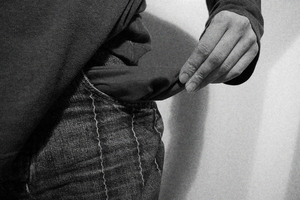

Transporter moins, ou les poches vides
######################################
:date: 2012-03-13 12:47

Traduction de http://mnmlist.com/carry-less-or-pockets-like-air/.

    
    Photo courtoisie de `stuartpilbrow
    <http://www.flickr.com/photos/stuartpilbrow/2942333106/>`_

`Par Leo <http://twitter.com/zen_habits>`_

Combien de choses est-ce que vous transportez avec vous, chaque jour ?

C'est quelque chose dont on ne se soucie pas souvent, mais chacun des éléments
que nous transportons est un petit fardeau, et ces petits fardeaux
s'additionnent.

Ils contribuent à notre fatigue générale, sont une chose supplémentaire dont il
faut se soucier, et ils peuvent même poser des problèmes de dos si on en
transporte trop.

C'est une chose que j'ai énormément amélioré dans ma vie, depuis que j'ai
décidé d'essayer d'être le plus minimaliste possible il y a quelques années.

Comme l'a dit Robert Daeley dans un ancien billet, `Zen Pockets
<http://www.celsius1414.com/zen_pockets/>`_ :

    Dans l'esprit de `GTD
    <http://zenhabits.net/2007/02/beginners-guide-to-gtd/>`_, dans lequel vous
    essayez de vider votre tête de tout le fatras et de tous les soucis pour
    pouvoir vous concentrer de manière créative sur les tâches en cours,
    penchons-nous sur nos fardeaux pour voir si nous pouvons défaire un peu de
    nos habits de Sisyphe quotidiens. Un esprit comme de l'eau (NdT : *Mind
    like water*) ? Je vous présente *les poches vides*.

Voyons comment nous pouvons arriver à avoir des poches vides.

Ce que les gens transportent en général
~~~~~~~~~~~~~~~~~~~~~~~~~~~~~~~~~~~~~~~

Qu'y a-t-il dans vos poches, sacoche, sac à main, mallette ? Que prenez-vous
avant de quitter votre maison ? Quelques exemples de ce que les gens portent :

* Porte-monnaie, contenant de l'argent, plein de cartes, des bons de réduction,
  etc.
* Sac à main, contenant des nécessaires de toilette, du maquillage, des
  mouchoirs, carnet d'adresse, etc.
* Ordinateur portable avec câbles et accessoires
* Mallette avec document et papiers
* Téléphone portable, PDA, iPhone ou autre appareil mobile
* Sac à dos
* Livres
* Clés
* Calepin
* Stylo(s)
* Organiseur papier, aussi connu sous le nom de *Hipster PDA*
* Montre
* Articles de toilette
* Tasse à café
* Déjeuner
* Un lot de barres énergétiques, mouchoirs, pansements, etc.
* Ceinture de Batman

OK, le dernier ne s'applique peut-être qu'à Batman, mais tous les autres sont
assez courants. J'ai moi aussi porté la plupart de ces objet à un moment ou à
un autre.

Mes poches minimalistes
~~~~~~~~~~~~~~~~~~~~~~~

En ce moment, j'en suis arrivé à quelque chose d'assez simple :

* téléphone portable (pas un iPhone – il ne fait que téléphoner, pas d'emails
  ou d'internet)
* clés – bien que si je ne conduise pas, je ne prends que la télécommande
  d'ouverture de la voiture, pas les clés
* un “porte-monnaie” mince – en fait c'est juste un `moneyband
  <http://money-band.com/>`_ avec ma carte d'identité, carte de crédit et cash.

Et c'est tout. Parfois je prends un livre, d'autres fois un calepin, ou encore
un ordinateur portable dans un sac à dos si je vais écrire. Tout dépend de ce
que je compte faire.

Vous remarquerez que je ne transporte pas beaucoup de gadgets électroniques (je
ne prends mon ordinateur portable qu'une ou deux fois par semaine), je n'ai pas
de montre, je n'ai pas grand chose dans mon “porte-monnaie”, je n'ai pas
d'articles de toilette (bien entendu, mon crâne rasé m'aide pour ça).

Comment j'en suis arrivé à être minimaliste
~~~~~~~~~~~~~~~~~~~~~~~~~~~~~~~~~~~~~~~~~~~

Je n'y suis pas arrivé en une nuit. J'y suis arrivé en réduisant mes besoins,
et en examinant chacun de mes objets pour voir si j'avais vraiment besoin de le
transporter.

#. **Réduire les besoins**. Comme je l'ai mentionné, quand j'ai décidé de me
   raser la tête, ça impliquait que je n'aurais pas besoin d'articles de
   toilette. Maintenant, je ne dis pas que vous devriez raser votre tête, mais
   envisagez de trouver des moyens de réduire votre besoin pour ces produits en
   simplifiant. J'ai aussi décidé que je n'avais pas besoin d'une montre, parce
   que (1) je préfère ne pas trop me soucier de l'heure et (2) si j'ai besoin
   de savoir l'heure, je peux regarder mon téléphone portable. J'ai décidé que
   je n'avais pas besoin d'un téléphone portable comme un iPhone ou un
   Blackberry, car bien que ce soit chouette de pouvoir consulter mes emails,
   chercher quelque chose sur internet ou surveiller mon site web ou mon
   entreprise quand je suis en déplacement, je préfère ne pas avoir cette
   distraction continuelle. J'aime être dans l'instant, surtout quand je suis
   avec ma femme, mes enfants ou un ami. J'aime ne pas être interrompu.
   Réfléchissez à vos besoin, et si ce sont vraiment des besoins ou si ils
   peuvent être éliminés ou réduits.
#. **Passez chaque objet au test**. Inspectez chaque élément que vous prenez
   avec vous, et si vous en avez vraiment l'utilité chaque jour. Si ce n'est
   pas le cas, ne les emportez que les jours où vous en avez besoin. Si vous
   transportez une mallette pleine de documents que vous n'ouvrez jamais,
   pourquoi les balader ? En fait, pourquoi ne pas garder vos documents sur
   votre ordinateur, et les consulter en ligne, de n'importe où ? Si vous avez
   un sac à main, faites en sorte que chacun des objets contenus passe ce test
   critique : Est-ce que vous l'utilisez vraiment, tout le temps ? Est-ce que
   vous en avez besoin ? Si non, envisagez de le laisser à la maison, ou, si
   vous ne pouvez vous décider, mettez le dans votre boîte à gants, pour ne pas
   avoir à le transporter partout. J'ai fait ça pendant un moment, juste pour
   être rassuré, et j'ai fini par ne jamais avoir besoin de ces objets.

Soyez légers
~~~~~~~~~~~~

C'est sympa de pouvoir se promener sans rien qui vous alourdisse. Vous vous
sentez léger et libre. C'est moins de fardeau.

Il y a quelque chose de paisible à propos des déplacements sans ces
distractions. Vous pouvez vous concentrer sur ce monde merveilleux qui vous
entoure. Vous pouvez parler à un ami ou membre de votre famille sans
interruptions. Vous pouvez créer sans être distraits.

Marchez léger, cœur illuminé.
